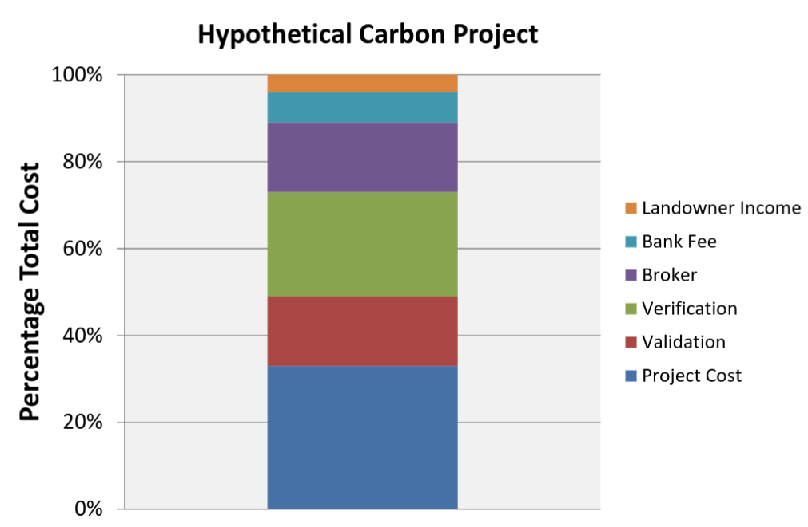

# Deliverable week 1: scoping the problem to solve

## Vision
Carbon-neutral economy by 2040.

## Our Value proposition
The decentralized, open & transaprent carbon accounting ecosystem needed to achieve this vision.

## Problem statement

Big picture: Carbon markets are not sufficiently effective to tackle the climate crisis fast enough.

Three underlying problems:
1. Carbon markets are fragmented, intransparent and prone to double counting
2. Carbon offsets are hot air & intermediaries take a big cut of the pie
3. Governments—who should put the policies in place to tackle these problems—are incapable of providing the open & transparent accounting infrastructure we need to solve these problems.

### Context

Currently, the global capacity for CO2 removal is on the order of
10–1,000 kilotonnes CO2/year.  To limit global median warming to 1.5°C
above pre-industrial levels, a 1,000-100,000x increase in negative
emission capacity is needed within 30 years (as outlined by the IPCC
and other bodies).  [We have to sequester >1,5 trillion tonnes of CO2
in order to revert to 300 ppm in the atmosphere.](https://nori.com/white-paper)

[Carbon offsetting requires 4 factors in order to be
effective](http://www.greeninvestmentservices.com/carbon-offsets/key-principles-of-vers):

  - **Additionality** (prove it wouldn't have happened otherwise)
  - **Sustainability** (prove it has long-term impact)
  - **Verifiability** (prove legitimacy via independent third party)
  - **Reliability** (prove it hasn't been double-sold)

At least the latter two of these can be addressed using blockchain
technology.

## Why is blockchain needed to solve this problem?

Blockchain (in this case specifically *public* blockchain) helps solve
the following challenges in carbon offsetting:

### **Problem:** Reliability

Current carbon markets are opaque and ineffiecient, so there is a
high risk of offsets being counted twice.

**Solution:** Blockchain technology was designed specifically to solve
the "double spend" problem, by providing a public, transparent,
decentralized, immutable, verifiable ledger.

### **Problem:** Carbon markets are fragmented

**Solution:** Blockchain provides a common platform / level playing
field owned by nobody/everybody.  It provides a platform on which
products can be built way faster than governments are typically
capable, without ruling out the possibility of both the public and
private sectors converging onto the same platform whenever they are
ready.

Blockchain also enables *composability*: permissionless building of /
integrating with other systems.  The benefits of this freedom have
already been demonstrated by the sudden explosion of creativity and
products in the DeFi space.

### **Problem:** Intermediaries in the value chain all take a slice for profit

The USDA Office of Environmental Markets provided this illustration of
the typical cost structure associated with getting a credit to market:

[source: ["Transaction Costs in Carbon Offset
Markets", 2016](https://www.c-agg.org/wp-content/uploads/Zook_C-AGG_Presentation_March_8.pdf)]

**Solution:** Blockchain reduces the number of middle-men.

### **Problem:** Governments are incapable of providing the global carbon accounting infrastructure

**Solution:** An open ecosystem. Like DeFi for carbon accounting: DeCA.
DeFi has seen massive growth in these last 12 months.
A (non-exhaustive) list of the reasons for its success are:
* composability & modularity
* high liquidity
* unlocking new markets
* open standards & development
* programmability & automation
* transparency

We think that tokenized carbon offsets will unlock the locked potential in current carbon markets—just like DAI unlocked DeFi.
The characteristics of decentralized and open systems give them an almost unfair advantage over centralized systems.

### What demographics do you serve? What is the size of the market?

We believe that climate change is the first challenge which can only
be solved as a global community, and we aim to serve all generations,
especially the ones which have not been born yet.

The global value of carbon pricing schemes was $82bn in 2017, [a 56%
increase on the previous
year](http://www.climateaction.org/news/global-carbon-market-increases-by-56-in-one-year-says-world-bank).

The size of the global compliance market in 2018 was [$57B](https://icapcarbonaction.com/en/?option=com_attach&task=download&id=625).
However, this market has high barriers to entry due to stronger regulation.
This is why we focus on the voluntary carbon market first.

In 2018, [the voluntary market offset
approximately 100 megatonnes of CO2 (volume)](https://www.ecosystemmarketplace.com/articles/voluntary-carbon-volume-hits-seven-year-high-on-demand-for-natural-climate-solutions/).
At $3 per offset this corresponds to a market value of $300M, and a
52.6% increase over 2016.

From talking to other players in the market (Nori, Southpole, Atmosfair, ...) demand for quality offsets is currently outstripping supply.

## What other solutions are currently being used to address this problem (other companies, workarounds, systems or processes that can compete with or substitute your product)

We haven't been able to carry out a full competitive analysis yet. However, these are our hypotheses:

*  Current players in the voluntary market like Verra & GoldStandard hold the majority of the market. They are providing the trust-layer of current offsets. Since they are in this "monopoly-like" position, they take big cuts. We think blockchain technology can replace those entities because it's more efficient at providing trust.
* New players like Nori, Project Wren, Panchama, Regen Network are all solving specific problems along the carbon offset value chain. Our open DeCA ecosystem aims to integrate all of them. Only togehter can we solve this crisis fast enough.

### Encumbents

| Description | Competitive analysis |
|-|-|
| Verra | currently 60% of voluntary carbon market |
| ... | ... |

### Blockchain-based solutions

| Description | Competitive analysis |
|-|-|
| Carbon Offset Initiative |   |
| AirCarbon |   |
| Nori | Building a compoletely new asset class: tokenized soil carbon  |
| DAO IPCI |   |
| Spark Change |   |
| [Climate Ledger](https://www.climateledger.org/) |   |
| [Veridium](https://www.veridium.io/) are [working with IBM](https://www.technologyreview.com/s/611670/blockchain-explainer-tokenizing-carbon-credits/) |   |

## What are the geopolitical, cultural-social-economic factors that must be taken into consideration?

Current geopolitical structures don't allow for the emergence of a
global and open carbon accounting system, because we still think in
terms of nation states.  The current COVID-19 crisis highlights the
inherent flaws in global society's ability to deal with global crises.

Not all nations have contributed equally to causing the problem, nor
to solving it.  Some emerging economies are driven more by basic needs
for energy than by awareness of climate change or the motivation to
address it.

Blockchain provides a unique opportunity to circumvent these weaknesses
and rapidly develop new ecosystems which facilitate carbon offsetting
in ways which simply do not exist yet.

## What are some nuances and complexities that must be addressed?

### Usability

The quality of UX within most blockchain UIs is still sub-standard and
too difficult for non-technical users to understand.

CO2ken strives for maximum usability, but is still somewhat limited by
the UX of underlying technologies such as MetaMask.

### DAO mechanism design

The CO2ken DAO needs effective economic incentives for the curation of
high quality carbon offsetting projects.  Careful consideration is
required regarding how both revenue and power can be distributed and
earnt within the DAO, and what decisions and actions it is able to
take.

### The oracle problem

Prices of carbon offset are externally set, but need to be tracked
within the blockchain.  This brings in all the usual problems
associated with building a trustworthy and reliable oracle.

### Offsetting the offsetter

CO2ken currently uses the Ethereum public chain, which itself is
responsible for consuming vast amounts of electricity due to its Proof
of Work algorithm.  Whilst this may improve in the future, it is
necessary for CO2ken to lead by example, by ensuring that any
transactions it executes have the appropriate corresponding amount of
carbon offset.
